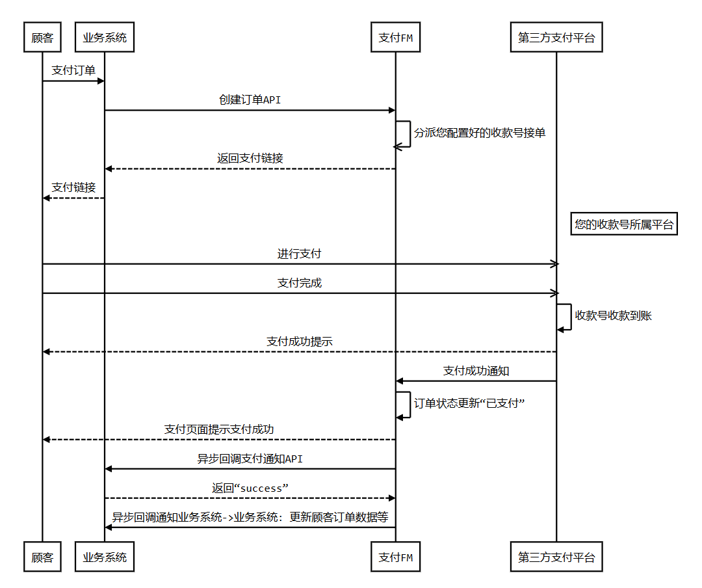

# 云计算与虚拟化技术 PJ gomall 

## 目录

[TOC]

## 运行方式

见`README_cn.md`。

## 改造说明

基于开源项目[gomall](https://github.com/cloudwego/biz-demo/tree/main/gomall)进行改造。

### 改造1：运行环境修复

该项目由社区维护，维护较为混乱，存在运行环境不统一的问题，导致仓库中的代码无法运行。

1. 在scripts/tidy.sh脚本中，修复go版本错误问题，统一使用1.23.0版本。
2. 修复about页面无法打开的问题，原页面只监听POST请求，改为监听GET请求。

### 改造2：价格计算方式修复

原项目中，商品价格的计算采用浮点数进行计算，存在精度问题，导致价格计算错误。

为了更清晰地阐述这个问题，我编写了一个简单的c程序来演示：

```c
#include <stdio.h>

int main() {
    int a = 1000000;
    float b = 1.00f;
    int c = 1;
    float d = 0.04f;
    
    float result = a * b + c * d;
    
    printf("Result: %.2f\n", result);
    return 0;
}
```

输出：

```
Result: 1000000.06
```

然而，期待的结果应该是1000000.04。

根据浮点数的定义，我们可以知道，数字越大，浮点数精度损失越严重，因此，当价格足够大时，将导致精度损失，这对交易软件来说是不可接受的。

修复方式是，考虑到货币的最小单位是分（0.01元），将整个货币相关的内容放大一百倍，则必定得到整数，使用`uint64`类型进行存储和计算，需要小数的接口返回时，返回十进制小数而不是浮点数。

### 改造3: 真实支付环境接入

原项目为Go语言学习项目，支付模块仅为模拟支付，并未接入真实支付环境。

经过调研，我选择[支付FM](https://www.zhifux.com/)平台接入真实支付环境，该平台提供了丰富的支付方式聚合和良好的文档支持，适合快速集成和测试。

支付流程图如图。



// TODO
